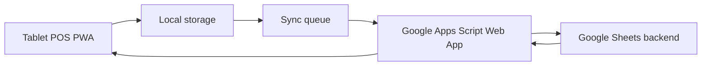

# Rice Box Online POS

Tablet-first POS for Rice Box Online. The app runs as a static PWA on GitHub Pages and syncs orders, menu, add-ons, payments, and inventory data through Google Apps Script into Google Sheets.

## What Is Included

- Front POS: menu tiles, add-ons, cart, queue number, payment method, discount, customer notes, and order save.
- Food photo menu cards for the four core rice box dishes.
- Back office: daily sales cards, order status board, delete order, menu price editor, inventory watch, sync queue, and CSV export.
- Offline/local mode: orders are saved locally first and queued for sync.
- Auto sync: saving an order immediately sends it to Google Sheets when the Apps Script URL is configured.
- Google Sheets backend schema: `Config`, `Menu`, `AddOns`, `Orders`, `OrderItems`, `Payments`, `Inventory`, `DailySummary`, and `SyncLog`.
- Apps Script backend: `apps-script/Code.gs`, including create order, update status, delete order, menu update, and bootstrap actions.
- PWA install support: `manifest.json`, `sw.js`, and app icon.

## Google Sheet

Spreadsheet:

https://docs.google.com/spreadsheets/d/1HQwONVniaYiNXFHYKJ7adSPHUQa1QMwtK0Bc-Y-jslo/edit

The sheet is prepared with the POS tabs and seeded with the Rice Box Online menu:

- ข้าวกะเพราหมู
- ข้าวหมูผัดน้ำมันหอย
- ข้าวผัดหมู
- ข้าวหมูกระเทียม

Default base menu price is 79 THB. Add-ons include fried egg, special, extra pork, extra rice, extra nam pla prik, and non-spicy/separate chili.

## Deploy GitHub Pages

1. Open the GitHub repository settings.
2. Go to Pages.
3. Choose `Deploy from a branch`.
4. Select branch `main`, folder `/root`.
5. Save.

The app is static and does not need a build command.

## Connect Google Sheets Sync

GitHub Pages cannot write directly to Google Sheets safely. Use Apps Script as the backend bridge.

1. Open the Google Sheet.
2. Go to `Extensions > Apps Script`.
3. Replace the script content with `apps-script/Code.gs`.
4. Keep `SPREADSHEET_ID` as:

   ```js
   1HQwONVniaYiNXFHYKJ7adSPHUQa1QMwtK0Bc-Y-jslo
   ```

5. Optional: set `APP_TOKEN` if you want a simple shared token.
6. Click `Deploy > New deployment`.
7. Select type `Web app`.
8. Set `Execute as` to `Me`.
9. Set `Who has access` to `Anyone with the link`.
10. Deploy and authorize the script.
11. Copy the Web App URL.
12. Open the POS app, go to `ตั้งค่า`, paste the Web App URL, and click `ทดสอบ Sync`.

## Data Flow



## First Real Use Checklist

- Confirm menu prices in the `Menu` tab.
- Confirm add-ons in the `AddOns` tab.
- Confirm opening stock in the `Inventory` tab.
- Deploy Apps Script and paste the Web App URL into the POS settings.
- Create one test order from the POS.
- Confirm the order appears in `Orders`, `OrderItems`, `Payments`, and `SyncLog`.
- Delete the test order from the POS back office.
- Confirm the test order is removed from `Orders`, `OrderItems`, and `Payments`.

## Security Note

This is designed for a small owner-operated shop. If the Apps Script Web App is published as `Anyone with the link`, anyone with the URL can call it. Keep the URL private. For stronger protection, set `APP_TOKEN` in `Code.gs` and paste the same token into the POS settings.

## Rollback

Because the app is static, rollback is simple:

- Revert the Git commit on `main`, or
- Change GitHub Pages back to a previous commit/branch, and
- Keep the Google Sheet data unchanged.
